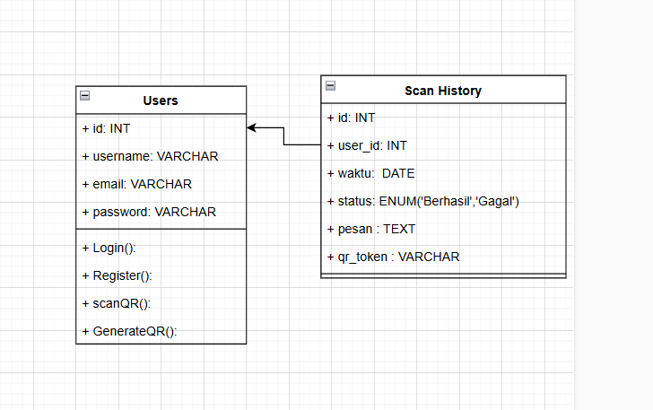
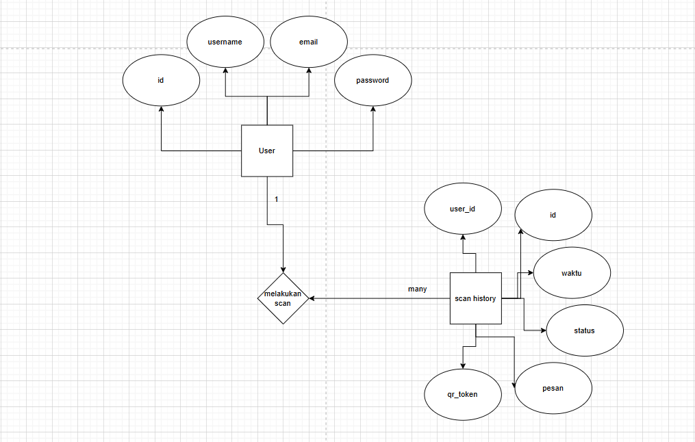
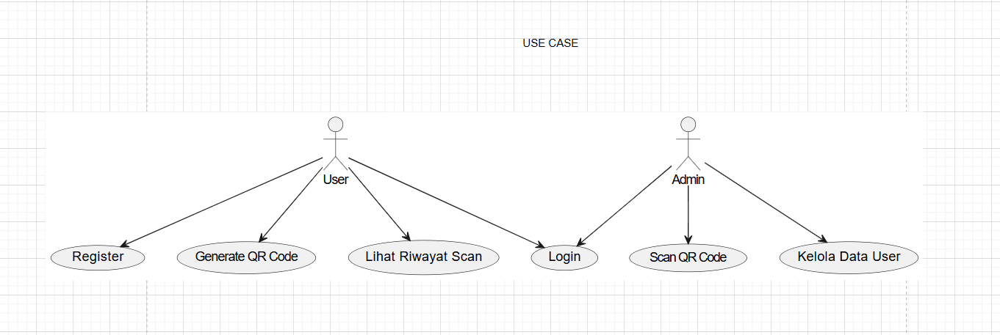

Nama : Alim Wijaya
Kelas : XII PPLG 
Tugas : UJI KOMPETENSI

# Tugas : Absensi Qr Code

## Deskripsi:
user dapat melakukan absen dengan qr code yang dibuat sendirinya dan di scan oleh admin

## Hubungan Antar Tabel:
### 1. User: Pengguna yang ingin absen.
### 2. Scan-history: Histori scan qr code yang dilakukan user.

## RELASI ANTAR ENTITAS ✍

### 1. Scan-history ke User (Mengambil data user):
Scan-history memiliki relasi dengan user, dimana setiap scan-history memiliki satu user yang terkait.  
relasi : One-to-Many

## Dependecies / Teknologi yang digunakan 💻

1. npm init -y

    Perintah ini digunakan untuk secara otomatis menginisialisasi dan membuat file package.json

    bash
    npm init -y
    

2. express

    Express JS sebagai framework Node.js untuk mengelola request dan response HTTP

    bash
   npm i express
    

3. mysql

    package untuk melakukan koneksi ke database

    bash
    npm i mysql2
    

4. Axios

    penginstalan axios
    bash
    npm i axios
    
5. qrcode

    penginstalan qrcode
    bash
    npm i qrcode

6. express-generator

    penginstalan express-generator
    bash
    npm i express-generator

7. nodemon

    penginstalan nodemon
    bash
    npm i nodemon

8. cors

    penginstalan cors
    bash
    npm i cors

9. dotenv

    penginstalan dotenv
    bash
    npm i dotenv

10. html5-qrcode

    penginstalan html5-qrcode
    bash
    npm i html5-qrcode

11. js-cookie

    penginstalan js-cookie
    bash
    npm i js-cookie 

12. qrcode.react

    penginstalan qrcode.react
    bash
    npm i qrcode.react
    

13. react-qr-code

    penginstalan react-qr-code
    bash
    npm i react-qr-code

14. react-qr-scanner

    penginstalan react-qr-scanner
    bash
    npm i react-qr-scanner

15. react-router-dom

    penginstalan react-router-dom
    bash
    npm i react-router-dom
    
16. sweetalert2

    penginstalan sweetalert2
    bash
    npm i sweetalert2   

17.
 
    

## CLASS DIAGRAM 

 
 

## ERD DIAGRAM

 

## USECASE DIAGRAM

 